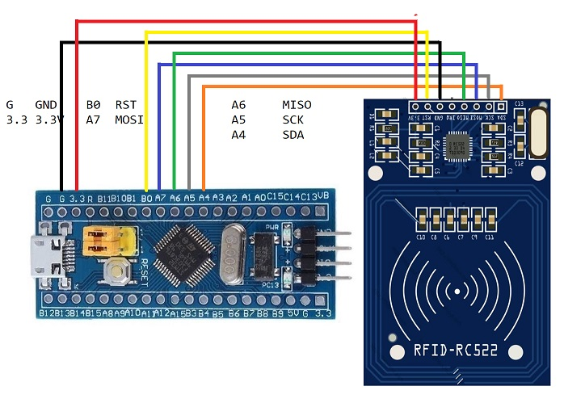
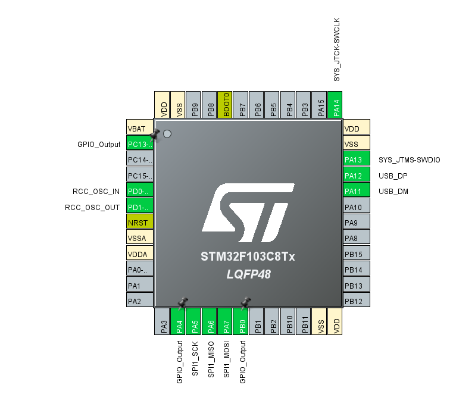
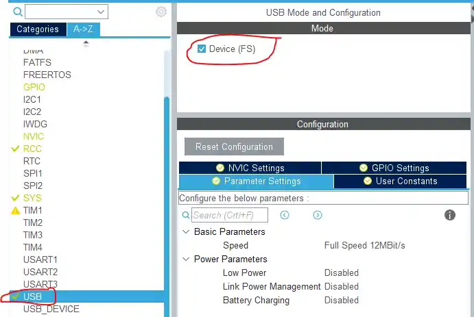
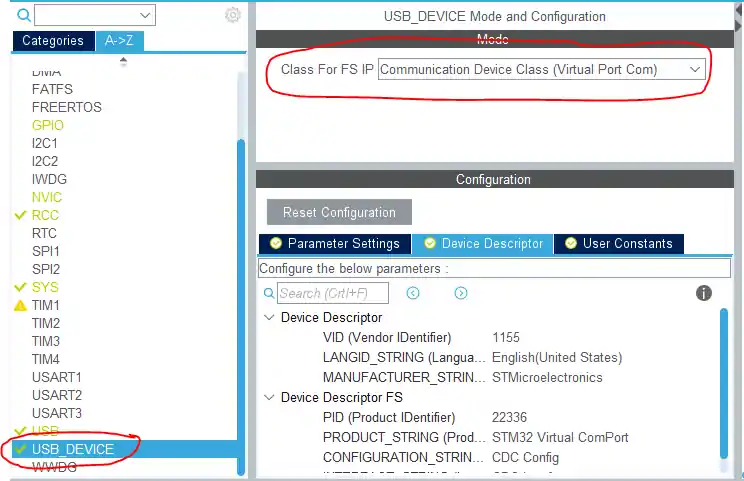
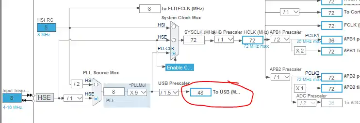

# RC522 + USB UART

- [RC522](https://www.youtube.com/watch?v=ujEqJRWthjw)

- [USB UART](https://controllerstech.com/send-and-receive-data-to-pc-without-uart-stm32-usb-com/)

# RC522

# USB UART

### Finally the clock is set to maximum here. As you can see above, the USB clock is automatically adjusted to 48 MHz